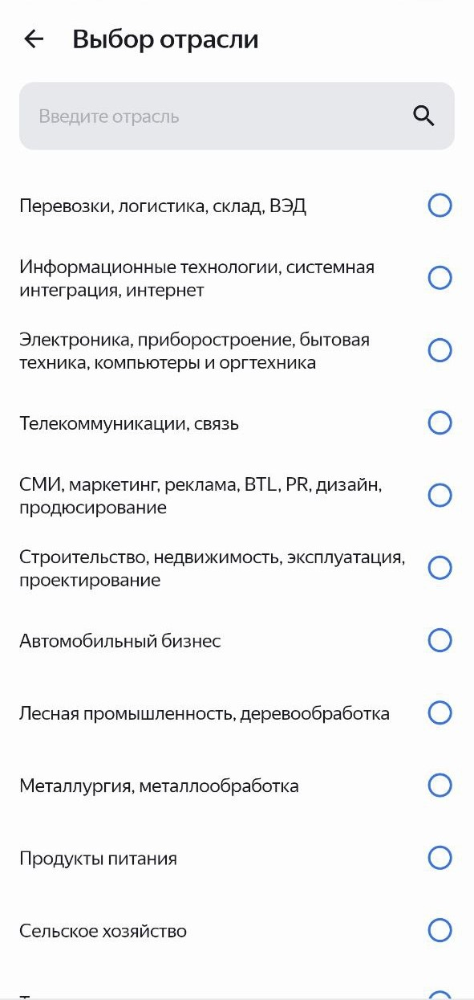

# Job Aggregator

## О приложении
**Job Aggregator** — групповой дипломный Android-проект (4 человека) по курсу 
«Android-разработчик» (Yandex.Practicum). Приложение позволяет искать 
вакансии через учебное API, фильтровать результаты, просматривать подробную 
информацию о вакансии, совершать звонок/открывать почту по клику, а 
также сохранять вакансии в «Избранное».

Репозиторий курса и ТЗ: https://github.com/Yandex-Practicum/practicum-android-diploma

## Ключевые фичи
- Поиск вакансий по текстовому запросу.
- Фильтры: местоположение, отрасль, желаемая зарплата, опция «только вакансии с зарплатой».
- Пагинация результатов.
- Просмотр детальной информации о вакансии: звонок по номеру, отправка письма по e-mail.
- Сохранение вакансий в «Избранное» и доступ к ним без интернета.

## Технологии
- Язык: Kotlin
- Архитектура: MVVM, элементы Clean Architecture
- Асинхронность: Coroutines
- Сеть: Retrofit2, Gson, OkHttp
- База данных: Room
- DI: Koin
- Navigation: Jetpack Navigation Component (safeArgs)
- Библиотеки: Glide, AndroidX, LiveData, ViewModel и др.

(точные версии зависимостей см. в app/build.gradle / gradle/libs.versions.toml)

## Мой вклад
- Проектирование структуры по Clean Architecture / MVVM.
- Реализация нижней навигации и Host Activity / фрагментов.
- Поиск вакансий (UI → ViewModel → Repository → NetworkClient) и ручная пагинация.
- Экран фильтров, сохранение фильтров (SharedPreferences) и интеграция в поиск.
- Code review, декомпозиция эпиков / тасок, исправление багов и интеграция командных изменений.

## Скриншоты
<p>
  
  &nbsp;
  
</p>
<p>
  
  &nbsp;
  
</p>

## Тесты

В проекте есть unit- и instrumented-тесты (используются MockWebServer и AndroidJUnit4).  
Тестовые JSON-файлы находятся в `androidTest/assets/` (`areas.json`, `industries.json`, `vacancies.json`, `vacancy.json`).

Запуск (Android Studio):
- Правой кнопкой по `androidTest` → **Run 'All Tests'** (или Ctrl+Shift+F10).

Примечание: instrumented-тесты требуют подключённого устройства или запущенного эмулятора.


## Как запустить (локально)

### Требования
- Android Studio
- Android SDK (minSdk = 26)
- Интернет (для доступа к учебному API)

### Предварительная настройка (обязательно) и запуск
1. Клонируйте репозиторий:
 ```bash
   git clone https://github.com/STer231/practicum-android-diploma
   ```
2. Откройте проект в Android Studio.
3. Получите API-токен [на странице логина](https://practicum-diploma-8bc38133faba.herokuapp.com/login).
4. В корне проекта откройте файл `develop.properties`, вместо GH_API_ACCESS_TOKEN вставте полученый ранее токен.  
**Важно:** develop.properties добавлен в .gitignore — не коммитьте реальный токен. 
5. File → Sync Project with Gradle Files, затем запустите приложение на эмуляторе или устройстве.

## Команда
Проект разработан совместно четырьмя участниками: 
[Сентябрина](https://github.com/SintyTrishina), 
[Никита](https://github.com/KitLeskinen), 
[Алексей](https://github.com/CapitanLatinamerica), 
[Сергей](https://github.com/STer231). Большую часть работы каждый выполнял 
над собственными экранами, при этом участники регулярно помогали друг другу, 
совместно решали архитектурные и логические задачи и вносили правки по 
всему приложению.


## Контакты
GitHub: https://github.com/STer231  
Email: 70013593z@gmail.com  
Telegram: https://t.me/SDTeryaev
